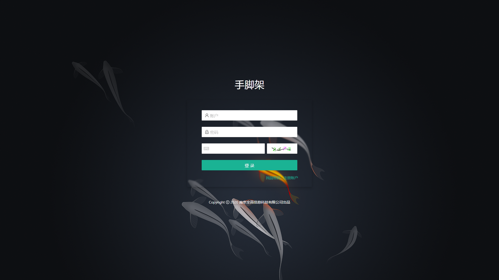

# 1. react + electron 手脚架

- [ ] 自己实现标题栏



<!-- TOC -->

- [1. react + electron 手脚架](#1-react--electron-手脚架)
- [2. 概述](#2-概述)
- [3. 安装与运行](#3-安装与运行)
- [4. 提交代码](#4-提交代码)
- [5. 构建与发布](#5-构建与发布)
  - [5.1. 构建环境变量](#51-构建环境变量)
  - [5.2. 其他环境变量](#52-其他环境变量)
- [6. 项目结构](#6-项目结构)
  - [6.1. 目录结构](#61-目录结构)
- [7. 开发环境配置](#7-开发环境配置)
- [8. 组件用例](#8-组件用例)
- [9. 菜单动态加载组件](#9-菜单动态加载组件)
- [10. FAQ](#10-faq)

<!-- /TOC -->

# 2. 概述

基于 `mobx` + `react` + `react router` + `umi` +`TypeScript` 的 electron 客户端
组件库选用 `antd`,`teaness`

# 3. 安装与运行

> 安装 `npm i`

ps: 建议 `cross-env LECTRON_MIRROR=https://cdn.npm.taobao.org/dist/electron/ npm i` 安装

> 运行 `npm run start`

# 4. 提交代码

> 遵循 https://www.conventionalcommits.org/
> 也可以使用 npm run commit 来快速格式化提交

# 5. 构建与发布

> 执行 `npm run release`生成 tag
> 执行 `npm run build`构建
> 如有 `sentry` 启用需求,需要在项目下添加 `.sentryclirc` 文件,具体文件格式请参照 `sentry` 官网文档

## 5.1. 构建环境变量

- `UA` google analytics,默认无(不开启 google analytics)
- `AES` AES 秘钥,默认 test
- `DSN` sentry DNS,默认无(不开启 sentry)

## 5.2. 其他环境变量

可以建一个 `.env.local` 覆盖 umi 环境变量

具体参考[umi 环境变量](https://v2.umijs.org/zh/guide/env-variables.html#%E5%A6%82%E4%BD%95%E9%85%8D%E7%BD%AE)

# 6. 项目结构

## 6.1. 目录结构

```
├─config 项目配置目录
│  ├─pages.ts 页面与菜单id绑定
│  ├─projectConfig.ts 项目配置文件,如前缀,项目名,打包base路径等等
│  ├─proxy.ts 代理 dev环境下代理接口路径配置
│  └─route.ts 路由配置文件(除非本地路由,不然不需要动这个问题,直接去`pages.ts`绑定菜单id即可)
├─public 公共资源文件(目前只有网站ico图标)
├─src
│  ├─assets 静态的资产(图片,svg,json等等)
│  ├─block 业务组件 (与业务强关联的组件,甚至可以是一个页面)
│  ├─components 通用组件 (与业务无关的通用型组件)
│  ├─layouts 页面框架,不需要动
│  ├─pages 路由页面  改文件夹下也可以定义 Component 文件夹用来区别非页面的业务强关联非多个页面复用的组件
│  ├─service 接口(所有接口的聚合)
│  ├─stores 状态库(mobx 状态库,如果是全局状态需要在Global.ts注册)
│  ├─utils
│  │  ├─authority.ts 权限封装
│  │  ├─cache.ts 缓存封装
│  │  ├─request.ts request请求封装
│  │  ├─utils.ts 工具集
│  ├─app.ts 参考umi文档,不需要动
│  ├─constant.ts 常量
│  ├─global.scss 全局css
│  ├─typings.scss 比较重要的type定义
├─...

```

pages 下的 `.umi`,`.pages.ts`是自动生成的不允许动

# 7. 开发环境配置

vscode settings 可以配上

```javaScript
{
    "prettier.eslintIntegration": true,
    "eslint.validate": [
        "javascript",
        "javascriptreact",
        "typescript",
        "typescriptreact",
        { "language": "javascript", "autoFix": true },
        { "language": "javascriptreact", "autoFix": true },
        { "language": "typescript", "autoFix": true },
        { "language": "typescriptreact", "autoFix": true }
    ],
}
```

# 8. 组件用例

组件库地址
外网,需翻墙加速 [teaness.org](https://teaness.org/)
内网,隐身模式访问 [teaness.org](http://teaness.org/)

# 9. 菜单动态加载组件

通过特殊的 url 标识与菜单结合
url 设计: `component:{block组件}({注入的组件props})path={url路径}`

例:`component:AutoGenPage({"type": "cnt"})path=cnt`

# 10. FAQ

> 默认是开启 mock 的,需要关闭,请创建`.env.local`文件,并添加 `mock=none`
